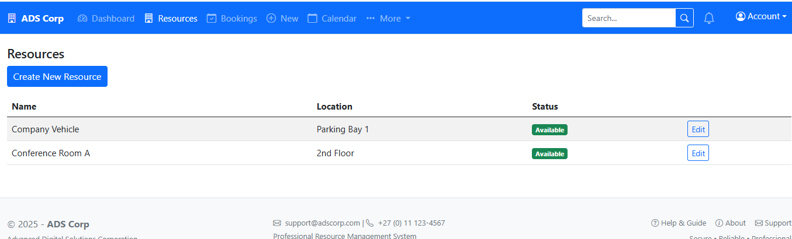

# ADS Corp Resource Booking System

Live demo: https://resource-booking.onrender.com

## Overview
Professional ASP.NET Core app for booking shared resources (meeting rooms, vehicles, equipment) with notifications and analytics. Uses a hybrid UI: Razor Pages for CRUD (Bookings, Resources) and MVC for complex areas (Dashboard, Reports, Calendar).

## Screenshots
Below are representative screenshots of key areas of the system. Images are located under `Documentation/`.

- Login: 
- Dashboard: 
- Resources: 
- Bookings: 
- Calendar: 
- Reports & Analytics: 

## Requirements
- .NET 8 SDK
- SQLite (default) or any EF Core-supported DB
- Internet connection for Bootstrap Icons CDN

## Quick Setup
1. Clone repository
2. Navigate to project directory:
   ```sh
   cd ResourceBooking
   ```
3. Restore and run:
   ```sh
   dotnet restore
   dotnet ef database update
   dotnet run
   ```
4. Open browser: https://localhost:5001 (or shown URL) or the deployment above.

## Key Features

### Dashboard & Analytics (MVC)
- Real-time overview, utilization, popular resources, trends

### Resource Management (Razor Pages)
- Full CRUD for resources, availability/unavailability tracking

### Booking System (Razor Pages + MVC endpoints)
- CRUD with conflict detection and recurring bookings
- Calendar view and CSV export (MVC)
- ICS downloads

### Notifications
- Email via MailKit and in-app notifications with polling and toasts

### Modern UI
- Bootstrap 5, Bootstrap Icons
- Accessible labels, aria attributes, modals
- Responsive cards and tables

## Architecture
- Razor Pages: `Pages/Bookings/*`, `Pages/Resources/*`
- MVC Controllers: `Dashboard`, `Reports`, `Bookings` (Calendar/Export/ICS), `Notifications`, `Search`, `EmailTest`
- Services: Email, Notifications, Calculations, Recurrence
- Data: EF Core with migrations and seeders

## Test Evidence
- Documentation/Testing Results Database Resource Booking System.pdf
- Documentation/Testing Results Resource Booking System.pdf

## Demo Accounts
- sipho@company.com / Demo123!
- thabo@company.com / Demo123!
- amanda@company.com / Demo123!

## Development
### Migrations
```sh
# create migration
dotnet ef migrations add MigrationName
# update db
dotnet ef database update
```

### Project Structure (partial)
```
Pages/
  Bookings/
    Index.cshtml(+.cs)
    Create.cshtml(+.cs)
    Edit.cshtml(+.cs)
  Resources/
    Index.cshtml(+.cs)
    Create.cshtml(+.cs)
    Edit.cshtml(+.cs)
Views/
  Dashboard/
  Reports/
  Bookings/Calendar.cshtml
```

## Deployment
- Render deployment: https://resource-booking.onrender.com
- Set connection string and email settings via environment variables or appsettings.

## Accessibility
- Forms include labels and validation summaries
- Buttons and links include aria labels and hidden text where needed
- Modals manage focus and provide clear actions

## License
MIT
